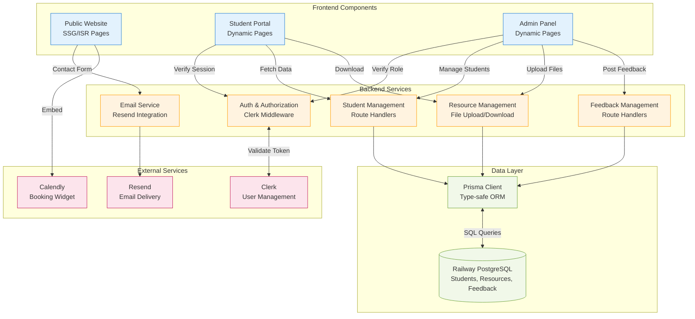

# Components Architecture

## Component: Public Website (Frontend)

**Responsibility:** Render SEO-optimized marketing pages, embed Calendly widget, handle contact form submissions, and provide bilingual content switching

**Key Interfaces:**
- `GET /[locale]` - Homepage with hero, testimonials, pricing
- `GET /[locale]/about` - Teaching philosophy page
- `POST /api/contact` - Contact form submission

**Dependencies:** Calendly Embed SDK, next-intl, Tailwind CSS, Resend API

**Technology:** Next.js 15 Server Components (SSG/ISR), React 19, Headless UI

---

## Component: Student Portal (Frontend)

**Responsibility:** Authenticated dashboard for students to view resources, download files, and read instructor feedback

**Key Interfaces:**
- `GET /[locale]/dashboard` - Main dashboard page
- `GET /[locale]/dashboard/resources` - Resource list view
- Client-side download handler for resources

**Dependencies:** Clerk SDK, API Route Handlers, React Markdown, Zustand

**Technology:** Next.js 15 App Router (dynamic rendering), Clerk React components

---

## Component: Instructor Admin Panel (Frontend)

**Responsibility:** Authenticated admin interface for managing students, uploading files, and posting feedback

**Key Interfaces:**
- `GET /[locale]/admin/students` - Student list table
- `GET /[locale]/admin/students/[id]` - Student detail page
- File upload form with drag-and-drop
- Rich text editor for feedback

**Dependencies:** Clerk SDK with role verification, API Route Handlers, file upload library, rich text editor

**Technology:** Next.js 15 Client Components, Server Actions, Clerk middleware

---

## Component: Authentication & Authorization Service (Backend)

**Responsibility:** Verify user identity, manage sessions, enforce role-based access control

**Key Interfaces:**
- Clerk Middleware (`middleware.ts`)
- `auth()` helper in Route Handlers
- Role metadata check for instructor vs. student

**Dependencies:** Clerk external service

**Technology:** `@clerk/nextjs` SDK, Clerk Middleware with `createRouteMatcher`

---

## Component: Student Management Service (Backend)

**Responsibility:** Create, read, and manage student accounts in database (linked to Clerk users)

**Key Interfaces:**
- `POST /api/admin/students` - Create student + Clerk user
- `GET /api/admin/students` - List all students
- `GET /api/admin/students/[id]` - Get student details

**Dependencies:** Prisma Client, Clerk Backend API, `Student` data model

**Technology:** Next.js Route Handlers, Prisma ORM, Zod validation

---

## Component: Resource Management Service (Backend)

**Responsibility:** Handle file uploads to PostgreSQL BYTEA, serve authenticated downloads

**Key Interfaces:**
- `POST /api/admin/resources` - Upload file
- `GET /api/resources/[id]` - Download file with auth check
- `DELETE /api/admin/resources/[id]` - Delete file

**Dependencies:** Prisma Client, Clerk `auth()`, `Resource` data model

**Technology:** Next.js Route Handlers with streaming, Buffer manipulation, 50MB validation

---

## Component: Feedback Management Service (Backend)

**Responsibility:** Create, read, and delete instructor feedback for students

**Key Interfaces:**
- `POST /api/admin/feedback` - Post feedback
- `GET /api/student/dashboard` - Retrieve feedback
- `DELETE /api/admin/feedback/[id]` - Delete feedback

**Dependencies:** Prisma Client, Clerk `auth()`, `Feedback` data model

**Technology:** Next.js Route Handlers, Prisma ORM, Markdown sanitization

---

## Component Interaction Diagram

---
