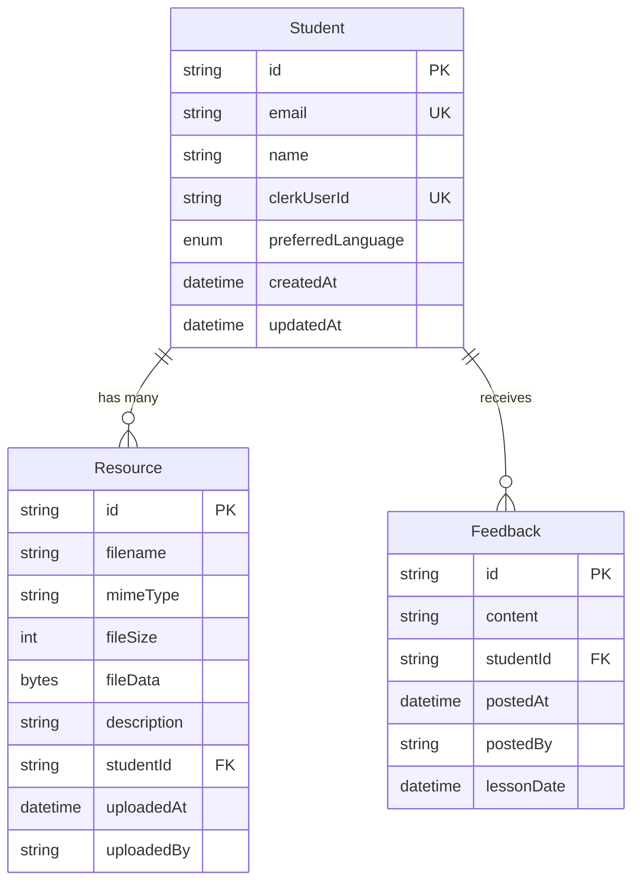

# Data Models

## Model: Student

**Purpose:** Represents students who book lessons and access the portal for resources and feedback

**Key Attributes:**
- `id`: String (UUID) - Primary key
- `email`: String - Student's email (unique, indexed)
- `name`: String - Student's full name
- `clerkUserId`: String - Foreign key to Clerk user (unique, indexed)
- `preferredLanguage`: Enum ('en' | 'fr') - Language preference for portal
- `createdAt`: DateTime - Account creation timestamp
- `updatedAt`: DateTime - Last profile update timestamp

### TypeScript Interface

```typescript
export interface Student {
  id: string
  email: string
  name: string
  clerkUserId: string
  preferredLanguage: 'en' | 'fr'
  createdAt: Date
  updatedAt: Date
  resources: Resource[]
  feedback: Feedback[]
}
```

### Relationships
- **One-to-Many** with `Resource` (a student can have multiple uploaded files)
- **One-to-Many** with `Feedback` (a student can receive multiple feedback posts)

---

## Model: Resource

**Purpose:** Represents files uploaded by the instructor for specific students (PGN, PDF, videos)

**Key Attributes:**
- `id`: String (UUID) - Primary key
- `filename`: String - Original filename (e.g., "lesson-1-game.pgn")
- `mimeType`: String - MIME type (e.g., "application/x-chess-pgn", "application/pdf")
- `fileSize`: Int - Size in bytes (max 50MB per NFR5)
- `fileData`: Bytes - Binary file content stored as PostgreSQL BYTEA
- `description`: String? - Optional description of the file
- `studentId`: String - Foreign key to Student
- `uploadedAt`: DateTime - Timestamp when instructor uploaded file
- `uploadedBy`: String - Clerk ID of instructor who uploaded (for audit trail)

### TypeScript Interface

```typescript
export interface Resource {
  id: string
  filename: string
  mimeType: string
  fileSize: number
  fileData: Buffer // Binary data in Node.js
  description: string | null
  studentId: string
  student: Student
  uploadedAt: Date
  uploadedBy: string // Clerk instructor ID
}
```

### Relationships
- **Many-to-One** with `Student` (each file belongs to one student)

---

## Model: Feedback

**Purpose:** Instructor's post-lesson notes and analysis visible to specific student

**Key Attributes:**
- `id`: String (UUID) - Primary key
- `content`: String - Rich text feedback (supports Markdown or HTML)
- `studentId`: String - Foreign key to Student
- `postedAt`: DateTime - Timestamp when feedback was posted
- `postedBy`: String - Clerk ID of instructor who posted
- `lessonDate`: DateTime? - Optional date of the lesson this feedback relates to

### TypeScript Interface

```typescript
export interface Feedback {
  id: string
  content: string // Markdown or HTML string
  studentId: string
  student: Student
  postedAt: Date
  postedBy: string // Clerk instructor ID
  lessonDate: Date | null
}
```

### Relationships
- **Many-to-One** with `Student` (each feedback entry belongs to one student)

---

## Entity Relationship Diagram



---
