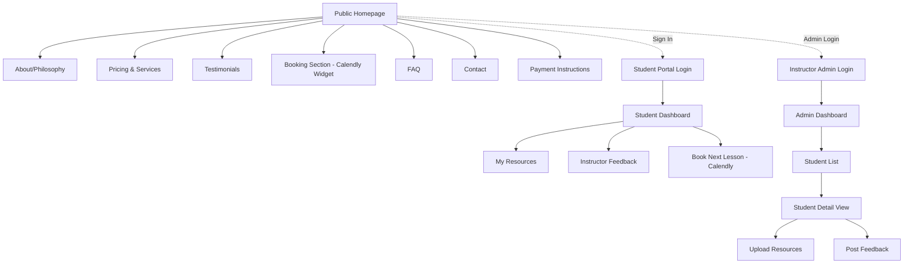
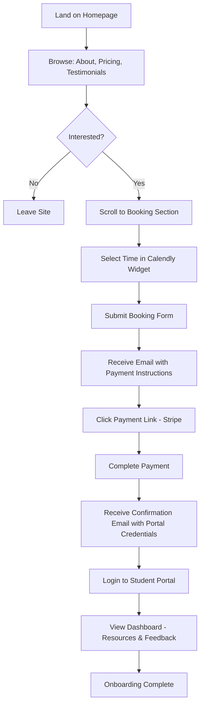
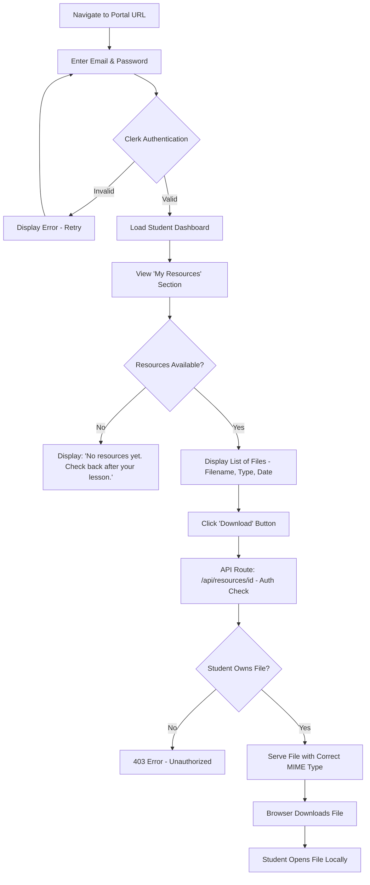
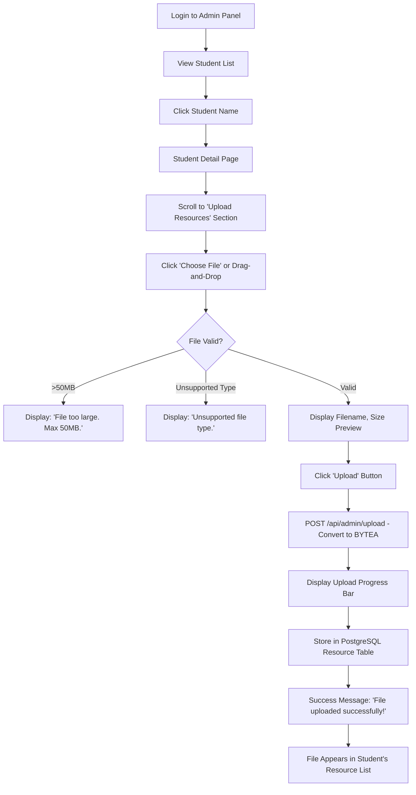
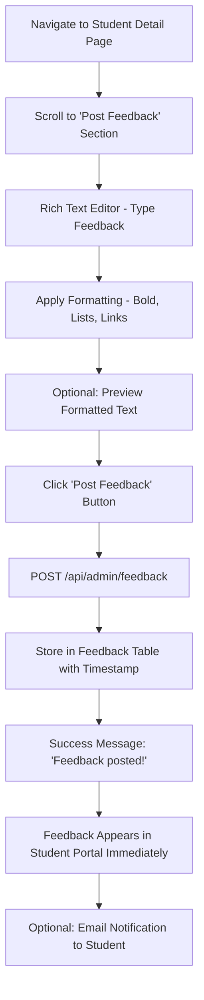

# Chess Coaching Platform UI/UX Specification

## Introduction

This document defines the user experience goals, information architecture, user flows, and visual design specifications for the Chess Coaching Platform's user interface. It serves as the foundation for visual design and frontend development, ensuring a cohesive and user-centered experience.

The platform targets beginner chess learners (ages 5-55, rating 0-1200) seeking personalized instruction through a clean, professional, and welcoming interface. The design follows modern e-learning aesthetics with full bilingual support (French/English).

### Overall UX Goals & Principles

#### Target User Personas

**Young Learners (Ages 5-12)**
- Parents act as booking agents and account managers
- Need highly visual, engaging interfaces with minimal text
- Short attention spans require quick task completion
- Progress visibility important for parent satisfaction

**Teen Learners (Ages 13-17)**
- Mix of independent and parent-assisted usage
- Comfortable with digital interfaces, expect modern UX patterns
- Motivated by achievement and skill progression
- Balance between fun and serious learning

**Adult Learners (Ages 18-55)**
- Fully self-directed, expect professional service delivery
- Learning for relaxation/mental exercise, not competition
- Value clarity, organization, and ease of access
- Appreciate structured curriculum with flexible pacing

**Parents (Secondary Users)**
- Book and pay for children's lessons
- Monitor progress and resource access
- Need confidence in instructor credentials and professionalism
- Value clear communication and transparency

#### Usability Goals

- **Ease of learning**: New users can book a lesson within 3 minutes of landing on the site
- **Efficiency of use**: Returning students access resources in <2 clicks from dashboard
- **Error prevention**: Clear validation for booking, payment, and file upload processes with confirmation dialogs for critical actions
- **Memorability**: Infrequent users (monthly lessons) can navigate without relearning the interface
- **Bilingual seamlessness**: French and English experiences feel native, not translated
- **Accessibility**: WCAG 2.1 AA compliance ensures platform usable by students with disabilities
- **Mobile optimization**: Parents booking on phones complete flow without friction

#### Design Principles

1. **Clarity over cleverness** - Use familiar e-learning patterns; avoid chess-specific jargon that confuses beginners
2. **Progressive disclosure** - Show booking flow step-by-step; reveal advanced features only when needed
3. **Consistent patterns** - Maintain visual hierarchy, button styles, and navigation across all sections
4. **Immediate feedback** - Loading states, success confirmations, clear error messages in plain language
5. **Accessible by default** - High contrast, keyboard navigation, screen reader compatibility from day one
6. **Welcoming, not intimidating** - Approachable imagery and tone; avoid elite chess culture aesthetics

### Change Log

| Date | Version | Description | Author |
|------|---------|-------------|--------|
| 2025-10-24 | 1.0 | Initial UI/UX specification creation | Sally (UX Expert) |

---

## Information Architecture (IA)

### Site Map / Screen Inventory

### Navigation Structure

**Primary Navigation (Public Site):**
- Sticky header with logo (left), language toggle (FR/EN, top-right), and main navigation links (About, Services, Pricing, Testimonials, FAQ, Contact)
- Prominent CTA button: "Book a Lesson" / "Réserver une leçon" (always visible in header)
- Mobile: Hamburger menu collapses navigation, CTA remains visible

**Secondary Navigation (Student Portal):**
- Dashboard sidebar (desktop) or bottom tab bar (mobile)
- Navigation items: Dashboard, Resources, Feedback, Book Lesson, Logout
- Persistent language toggle in header

**Secondary Navigation (Instructor Admin):**
- Admin sidebar with sections: Dashboard, Students, Settings, Logout
- Student detail page uses breadcrumbs: Admin > Students > [Student Name]

**Breadcrumb Strategy:**
- Public site: No breadcrumbs (flat hierarchy)
- Student portal: Minimal breadcrumbs (Dashboard > [Section])
- Admin panel: Full breadcrumbs for multi-level navigation (Admin > Students > Student Detail > Upload Resources)

---

## User Flows

### Flow 1: New Student Booking & Onboarding

**User Goal:** Discover coaching service, book first lesson, pay, and access student portal

**Entry Points:**
- Google search for "chess coach [city]" or "online chess lessons"
- Social media link to landing page
- Word-of-mouth referral with direct URL

**Success Criteria:**
- Student completes booking in <5 minutes
- Payment processed successfully
- Student receives credentials and accesses portal

#### Flow Diagram

#### Edge Cases & Error Handling:

- **No available time slots**: Display message "No availability this week. Check back soon or contact us." with contact link
- **Payment link expired**: Email includes "Payment link valid for 48 hours" with contact option for renewal
- **Failed payment**: Stripe error page redirects to retry or contact instructor
- **Forgot portal credentials**: Password reset link on login page (Clerk handles)
- **Parent booking for child**: Booking form includes "Booking for someone else?" checkbox to collect student name separately

**Notes:** Instructor manually creates student accounts after payment confirmation (not automated in MVP). This introduces 1-24 hour delay between payment and portal access.

---

### Flow 2: Student Accessing Resources

**User Goal:** Log in to student portal and download coaching materials

**Entry Points:**
- Bookmark to student portal URL
- Link in confirmation email
- Direct URL from instructor communication

**Success Criteria:**
- Student logs in successfully
- Resources displayed clearly
- Download initiated without errors

#### Flow Diagram

#### Edge Cases & Error Handling:

- **Large file (50MB)**: Display file size before download with "This may take a minute" message
- **Corrupted file**: Download fails - display error "File unavailable. Contact instructor."
- **Mobile download**: Ensure files download to device (not just open in browser tab)
- **Multiple simultaneous downloads**: Browser handles; no special UX needed
- **File types students may not have software for** (e.g., PGN): Include "How to open this file" help text

**Notes:** Files served via authenticated API route. Students can only access files uploaded specifically for them.

---

### Flow 3: Instructor Uploading Resources

**User Goal:** Upload a PGN file and PDF analysis for a specific student after a lesson

**Entry Points:**
- Admin dashboard after lesson completion
- Direct link to student detail page

**Success Criteria:**
- File uploads successfully to PostgreSQL
- Student immediately sees file in their portal
- No file size or type errors

#### Flow Diagram

#### Edge Cases & Error Handling:

- **File exceeds 50MB**: Prevent upload, suggest "Upload to YouTube/Vimeo and share link instead"
- **Database connection error during upload**: Display "Upload failed. Please try again." with retry button
- **Duplicate filename**: Allow upload (files distinguished by ID, not name)
- **Network interruption mid-upload**: Display "Upload interrupted" with retry option
- **Video files**: Recommend storing YouTube/Vimeo URLs instead of uploading large video files

**Notes:** Drag-and-drop interface preferred for desktop. Progress bar critical for large file uploads (30-50MB).

---

### Flow 4: Instructor Posting Feedback

**User Goal:** Post written feedback and game analysis notes for a student after reviewing their lesson

**Entry Points:**
- Immediately after lesson (from calendar reminder)
- From student detail page in admin panel

**Success Criteria:**
- Feedback posted successfully
- Student sees feedback immediately in portal
- Formatting preserved (bold, italic, lists)

#### Flow Diagram

#### Edge Cases & Error Handling:

- **Empty feedback**: Disable 'Post' button until text entered
- **Very long feedback (>10,000 characters)**: Display character count with soft limit warning at 5,000
- **Lost connection during typing**: Auto-save draft to local storage every 30 seconds
- **Formatting lost on save**: Ensure markdown or rich text preserved in database
- **Multiple feedback entries same day**: Allow unlimited feedback posts (sorted by timestamp)

**Notes:** Rich text editor should support markdown or basic HTML formatting. Mobile-friendly textarea for quick feedback on phone.

---

## Wireframes & Mockups

**Primary Design Files:** Figma (to be created based on this spec and reference image)

### Key Screen Layouts

#### Screen 1: Public Homepage (Landing Page)

**Purpose:** Convert prospective students by showcasing credentials, building trust, and providing clear booking path

**Key Elements:**
- **Hero Section:**
  - Large headline: "Start learning chess from the world's pro instructor" (FR: "Commencez à apprendre les échecs avec un instructeur professionnel")
  - Subheadline: "Start with more than 5,000 courses, certificates and degrees from world-class university" (adapt for chess coaching context)
  - Prominent CTA button: "Get In Touch" / "Nous contacter"
  - Large hero image: Professional photo of instructor or student learning (circular frame with accent background, similar to reference image)
  - Social proof metrics: "2,291 Happy Customers" → adapt to "X+ Students Taught", "4.8/5 Rating"
  - Decorative elements: Subtle chess piece icons or abstract shapes (not overwhelming)

- **About/Philosophy Section:**
  - Instructor credentials (chess rating, teaching experience)
  - Teaching philosophy in 2-3 paragraphs
  - Photos or illustrations of diverse students (children, teens, adults)

- **Pricing Section:**
  - Clear "$40/hour" display
  - What's included: 60-min lesson, personalized feedback, resource access
  - Payment process transparency

- **Testimonials Carousel:**
  - 3-5 student quotes with names/avatars
  - Star ratings
  - Age group indicators

- **Embedded Calendly Section:**
  - Header: "Book Your First Lesson"
  - Calendly widget (full-width on mobile, centered on desktop)
  - Instructional text: "Select a time below. Payment instructions will be sent to you."

- **FAQ Accordion:**
  - 8-10 common questions
  - Expandable answers

- **Contact Form:**
  - Fields: Name, Email, Subject, Message
  - Submit button

- **Footer:**
  - Language toggle (FR/EN)
  - Privacy policy link
  - Copyright notice

**Interaction Notes:**
- Sticky header with "Book a Lesson" CTA always visible
- Smooth scroll to booking section when CTA clicked
- Hero section uses modern gradient background (soft green/teal tones based on reference image)
- Responsive: Hero image stacks below text on mobile

**Design File Reference:** Figma Frame: "Public-Homepage-Desktop" and "Public-Homepage-Mobile"

---

#### Screen 2: Student Dashboard

**Purpose:** Provide students with single landing page showing all relevant information (resources, feedback, booking link)

**Key Elements:**
- **Header:**
  - Logo (left)
  - Welcome message: "Welcome back, [Student Name]!"
  - Language toggle (FR/EN)
  - Logout button

- **Sidebar Navigation (Desktop):**
  - Dashboard (active)
  - My Resources
  - Feedback
  - Book Next Lesson
  - Logout

- **Main Content Area:**
  - **Quick Actions Card:**
    - "Book Your Next Lesson" button → links to Calendly
    - "Last Lesson: [Date]" display

  - **My Resources Section:**
    - Card-based layout
    - Each resource shows: Filename, File type icon (PDF/PGN/etc.), Upload date, Download button
    - Empty state: "No resources yet. Your instructor will upload materials here."
    - Sort by: Most recent first

  - **Instructor Feedback Section:**
    - Card-based layout
    - Each feedback shows: Posted date, Feedback text (formatted), Expand/collapse for long feedback
    - Empty state: "No feedback yet. Check back after your first lesson!"

**Interaction Notes:**
- Click resource card anywhere to download
- Hover state on cards (subtle shadow lift)
- Mobile: Bottom tab navigation replaces sidebar
- Loading skeleton for resources/feedback while fetching data

**Design File Reference:** Figma Frame: "Student-Dashboard-Desktop" and "Student-Dashboard-Mobile"

---

#### Screen 3: Instructor Admin - Student List

**Purpose:** Give instructor quick overview of all students with ability to access individual student details

**Key Elements:**
- **Admin Header:**
  - Logo + "Admin Panel" label
  - Search bar: "Search students by name or email"
  - Language toggle
  - Logout

- **Admin Sidebar:**
  - Dashboard
  - Students (active)
  - Settings
  - Logout

- **Main Content:**
  - "Add Student" button (top-right, prominent)
  - **Student Table:**
    - Columns: Name, Email, Resources Count, Feedback Count, Last Lesson, Actions
    - Row click → Navigate to student detail
    - Actions column: "View Details" link
  - Pagination (if >50 students)
  - Empty state: "No students yet. Click 'Add Student' to get started."

**Interaction Notes:**
- Search filters table in real-time
- Table rows have hover state (light background change)
- Mobile: Cards replace table (show key info only)
- "Add Student" opens modal or navigates to form page

**Design File Reference:** Figma Frame: "Admin-Student-List-Desktop"

---

#### Screen 4: Instructor Admin - Student Detail & Upload

**Purpose:** Allow instructor to upload files, post feedback, and view student-specific information

**Key Elements:**
- **Breadcrumbs:** Admin > Students > [Student Name]

- **Student Info Card:**
  - Name, Email, Preferred Language
  - Number of lessons (future enhancement)
  - Portal access status (active/inactive)

- **Upload Resources Section:**
  - Drag-and-drop zone: "Drag files here or click to browse"
  - File type guidance: "Supported: PDF, PGN, TXT, DOCX, PNG, JPG (Max 50MB)"
  - File preview before upload (filename, size)
  - Upload button with progress bar
  - **Uploaded Files List:**
    - Table: Filename, File Type, Size, Upload Date, Delete button
    - Confirmation dialog before delete: "Are you sure? Students will lose access to this file."

- **Post Feedback Section:**
  - Rich text editor with toolbar (Bold, Italic, Lists, Links)
  - Character count indicator
  - "Post Feedback" button
  - **Posted Feedback History:**
    - List of previous feedback (chronological, newest first)
    - Each entry: Date posted, Feedback text, Edit/Delete buttons

**Interaction Notes:**
- Drag-and-drop zone highlights on drag-over
- Upload progress bar animates during file processing
- Success toast notification after upload: "File uploaded successfully!"
- Feedback editor auto-saves draft to local storage
- Mobile: Drag-and-drop replaced with "Choose File" button

**Design File Reference:** Figma Frame: "Admin-Student-Detail-Desktop"

---

## Component Library / Design System

**Design System Approach:** Custom lightweight design system built with Tailwind CSS, inspired by modern e-learning platforms (reference image aesthetic)

### Core Components

#### Button Component

**Purpose:** Primary interaction element for CTAs, form submissions, and navigation

**Variants:**
- **Primary:** Solid background, white text (e.g., "Book a Lesson", "Upload")
- **Secondary:** Outlined border, colored text (e.g., "Cancel", "View Details")
- **Tertiary/Link:** Text-only with underline on hover (e.g., "Learn More")
- **Danger:** Red background for destructive actions (e.g., "Delete")

**States:**
- Default
- Hover (slight darkening or shadow lift)
- Active/Pressed (slight scale down)
- Disabled (reduced opacity, no pointer)
- Loading (spinner icon, disabled interaction)

**Usage Guidelines:**
- Maximum one primary button per screen section
- Button text should be action-oriented ("Book Lesson" not "Click Here")
- Icon buttons (e.g., close, download) minimum 44x44px touch target
- Mobile: Full-width buttons for primary actions

---

#### Card Component

**Purpose:** Container for related content (resources, feedback, testimonials)

**Variants:**
- **Resource Card:** Icon + filename + metadata + download button
- **Feedback Card:** Date header + formatted text + expand/collapse
- **Testimonial Card:** Quote + student name + rating stars

**States:**
- Default
- Hover (subtle shadow elevation)
- Selected/Active (border highlight)
- Empty state (placeholder illustration + message)

**Usage Guidelines:**
- 16px padding on mobile, 24px on desktop
- Rounded corners (8px border-radius)
- Subtle shadow for depth (shadow-sm)
- Cards should be interactive (clickable) when containing actionable content

---

#### Form Input Component

**Purpose:** Text input, email input, file upload, textarea for user data entry

**Variants:**
- **Text Input:** Single-line text
- **Email Input:** Email validation
- **Textarea:** Multi-line text (feedback, messages)
- **File Upload:** Drag-and-drop or browse
- **Select Dropdown:** Language selection, filtering

**States:**
- Default (placeholder visible)
- Focus (border highlight, shadow)
- Filled (placeholder hidden, value visible)
- Error (red border, error message below)
- Disabled (grayed out, no interaction)

**Usage Guidelines:**
- Labels always visible (not placeholder-only)
- Required fields marked with asterisk (*)
- Error messages appear below input in red
- Accessible: aria-labels and keyboard navigation
- Mobile: Input font size minimum 16px (prevents zoom on iOS)

---

#### Navigation Header Component

**Purpose:** Persistent top navigation with logo, links, language toggle, and CTA

**Variants:**
- **Public Site Header:** Logo + nav links + language toggle + "Book a Lesson" CTA
- **Student Portal Header:** Logo + welcome message + language toggle + logout
- **Admin Header:** Logo + "Admin Panel" label + language toggle + logout

**States:**
- Default (white/light background)
- Sticky (shadow appears on scroll)
- Mobile (hamburger menu, collapsed navigation)

**Usage Guidelines:**
- Always sticky on scroll (position: fixed)
- Logo links to homepage (public) or dashboard (portals)
- Mobile: Hamburger icon (☰) opens slide-out menu
- CTA button always visible, even on mobile

---

#### Language Toggle Component

**Purpose:** Switch between French and English languages

**Variants:**
- **Toggle Switch:** EN | FR with slider indicator
- **Dropdown:** More scalable for future languages

**States:**
- English selected
- French selected
- Transitioning (brief loading state)

**Usage Guidelines:**
- Always visible in header (top-right)
- Selection persists via cookie
- Immediate content update on toggle (no page reload if possible)
- Icon flag optional: 🇬🇧 EN | 🇫🇷 FR

---

## Branding & Style Guide

**Brand Guidelines:** Custom chess coaching brand (professional yet approachable)

### Color Palette

| Color Type | Hex Code | Usage |
|------------|----------|-------|
| Primary | `#4A9B8E` | Primary buttons, hero accents, links (teal/green - calm, trustworthy) |
| Secondary | `#2C3E50` | Text headings, dark UI elements (dark blue-gray) |
| Accent | `#F39C12` | Highlights, icons, decorative elements (warm orange/yellow) |
| Success | `#27AE60` | Positive feedback, upload success, confirmations |
| Warning | `#F39C12` | Cautions, file size warnings, important notices |
| Error | `#E74C3C` | Errors, destructive actions, validation failures |
| Neutral | `#ECF0F1` (light gray), `#7F8C8D` (medium gray), `#2C3E50` (dark) | Text, borders, backgrounds |
| Background | `#FFFFFF` (white), `#F8F9FA` (off-white), `#E8F5E9` (light green tint for hero) | Page backgrounds, card backgrounds |

### Typography

#### Font Families

- **Primary:** Inter, -apple-system, BlinkMacSystemFont, 'Segoe UI', Roboto, sans-serif (modern, highly readable)
- **Secondary:** 'Merriweather', Georgia, serif (optional for headings or accent text)
- **Monospace:** 'Fira Code', 'Courier New', monospace (for technical content, PGN notation)

#### Type Scale

| Element | Size | Weight | Line Height |
|---------|------|--------|-------------|
| H1 | 48px (mobile: 36px) | 700 (Bold) | 1.2 |
| H2 | 36px (mobile: 28px) | 600 (Semi-bold) | 1.3 |
| H3 | 24px (mobile: 20px) | 600 (Semi-bold) | 1.4 |
| Body | 16px | 400 (Regular) | 1.6 |
| Small | 14px | 400 (Regular) | 1.5 |
| Button | 16px | 500 (Medium) | 1 |
| Caption | 12px | 400 (Regular) | 1.4 |

### Iconography

**Icon Library:** Heroicons (MIT license, clean line icons) or Lucide Icons

**Usage Guidelines:**
- 24x24px default size (scale up to 32x32px for primary actions)
- Stroke width: 2px (consistent with Heroicons)
- Icon + text label for clarity (icon-only acceptable for universally recognized actions like ❌ close, 🔍 search)
- Chess piece icons (♔♕♖♗♘♙) used sparingly for decoration, not functional UI

### Spacing & Layout

**Grid System:** 12-column grid on desktop (1280px max-width), single column on mobile

**Spacing Scale:**
- 4px base unit (Tailwind's spacing scale: 4, 8, 12, 16, 24, 32, 48, 64)
- Component padding: 16px (mobile), 24px (desktop)
- Section margins: 48px (mobile), 64px (desktop)
- Card gaps in grid: 16px (mobile), 24px (desktop)

**Layout Containers:**
- Max-width: 1280px (center-aligned with auto margins)
- Side padding: 16px (mobile), 32px (tablet), 48px (desktop)

---

## Accessibility Requirements

### Compliance Target

**Standard:** WCAG 2.1 Level AA compliance

### Key Requirements

**Visual:**
- Color contrast ratios: Minimum 4.5:1 for normal text, 3:1 for large text (18px+)
- Focus indicators: 2px solid outline on all interactive elements (keyboard navigation)
- Text sizing: Base 16px, scalable up to 200% without breaking layout

**Interaction:**
- Keyboard navigation: All features accessible via keyboard (Tab, Enter, Escape, Arrow keys)
- Screen reader support: Semantic HTML5, ARIA labels for dynamic content, alt text for images
- Touch targets: Minimum 44x44px for all buttons and interactive elements (mobile)

**Content:**
- Alternative text: Descriptive alt text for all images (e.g., "Professional chess instructor teaching beginner student")
- Heading structure: Logical hierarchy (H1 → H2 → H3), no skipped levels
- Form labels: Visible labels for all inputs, required fields marked, error messages associated with inputs

### Testing Strategy

- **Automated Testing:** Lighthouse accessibility audit in CI/CD pipeline (target 95+ score)
- **Manual Testing:** Keyboard-only navigation testing before each release
- **Screen Reader Testing:** NVDA (Windows) and VoiceOver (macOS/iOS) testing for critical flows (booking, login, resource access)
- **Color Contrast Verification:** WebAIM Contrast Checker for all text/background combinations

---

## Responsiveness Strategy

### Breakpoints

| Breakpoint | Min Width | Max Width | Target Devices |
|------------|-----------|-----------|----------------|
| Mobile | 320px | 639px | Smartphones (iPhone SE to iPhone 14 Pro Max) |
| Tablet | 640px | 1023px | iPads, Android tablets, small laptops |
| Desktop | 1024px | 1279px | Laptops, desktops |
| Wide | 1280px | - | Large desktops, external monitors |

### Adaptation Patterns

**Layout Changes:**
- Mobile: Single-column stacking, full-width cards
- Tablet: 2-column grids for resource/feedback cards
- Desktop: 3-column grids, sidebar navigation visible

**Navigation Changes:**
- Mobile: Hamburger menu (slide-out), bottom tab bar for portals
- Tablet: Full horizontal navigation, hamburger optional
- Desktop: Full horizontal navigation with dropdowns (if multi-level)

**Content Priority:**
- Mobile: Hero image below headline (text-first), testimonials in single-column carousel
- Desktop: Hero image right-aligned alongside text, testimonials in 3-column grid

**Interaction Changes:**
- Mobile: Drag-and-drop replaced with "Choose File" button, full-width buttons
- Desktop: Drag-and-drop zones, hover states for cards
- Touch devices: Larger tap targets (56x56px for primary actions)

---

## Animation & Micro-interactions

### Motion Principles

- **Purposeful, not decorative**: Animations guide attention and provide feedback, not just visual flair
- **Fast and subtle**: 200-300ms duration for most transitions (avoid slow, distracting animations)
- **Respectful of preferences**: Honor `prefers-reduced-motion` media query (disable animations for users who request it)
- **Consistent easing**: Use `ease-in-out` for most transitions, `ease-out` for entrances, `ease-in` for exits

### Key Animations

- **Button Click**: Scale down slightly (0.98) on press, return to 1.0 on release (Duration: 100ms, Easing: ease-in-out)
- **Card Hover**: Subtle shadow elevation increase, translate Y -2px (Duration: 200ms, Easing: ease-out)
- **Page Transitions**: Fade-in new content (Duration: 300ms, Easing: ease-in-out)
- **Success Toast**: Slide in from top with bounce (Duration: 400ms, Easing: cubic-bezier(0.68, -0.55, 0.27, 1.55))
- **Loading Spinner**: Continuous rotation for async actions (Duration: 1000ms infinite, Easing: linear)
- **Modal Open/Close**: Fade-in backdrop (Duration: 200ms), scale-up modal from 0.95 to 1.0 (Duration: 300ms, Easing: ease-out)
- **Form Validation Error**: Shake input horizontally (Duration: 400ms, Easing: ease-in-out)

---

## Performance Considerations

### Performance Goals

- **Page Load:** Initial page load <3 seconds on 4G connection (LCP < 2.5s, FID < 100ms, CLS < 0.1)
- **Interaction Response:** Button clicks and form submissions feel instant (<100ms perceived response time)
- **Animation FPS:** Smooth 60fps animations (avoid jank on low-end devices)

### Design Strategies

- **Image Optimization**: Use Next.js Image component for automatic WebP conversion, lazy loading, and responsive srcsets
- **Lazy Loading**: Defer loading of below-the-fold content (testimonials, FAQ) until user scrolls
- **Code Splitting**: Split admin panel and student portal into separate chunks (reduce initial bundle size)
- **Font Loading**: Use `font-display: swap` to prevent FOIT (flash of invisible text)
- **Minimize Animations on Low-End Devices**: Detect device performance, disable complex animations on slower devices
- **Skeleton Screens**: Display loading placeholders for resources/feedback instead of spinners (perceived performance)

---

## Next Steps

### Immediate Actions

1. **Create high-fidelity mockups in Figma** based on this specification and the provided reference image
2. **Review wireframes and design with stakeholder** (instructor) for feedback
3. **Prepare design assets** (logos, instructor photos, testimonial content, chess icons)
4. **Create component library in Figma** with reusable buttons, cards, forms, navigation
5. **Define bilingual content** for all screens (French and English translations)
6. **Handoff to Design Architect** for frontend architecture planning (Next.js component structure, Tailwind configuration, i18n setup)

### Design Handoff Checklist

- [x] All user flows documented
- [x] Component inventory complete
- [x] Accessibility requirements defined
- [x] Responsive strategy clear
- [x] Brand guidelines incorporated
- [x] Performance goals established
- [ ] High-fidelity mockups created in Figma (next step)
- [ ] Design tokens exported (colors, typography, spacing) for Tailwind config
- [ ] Interactive prototype created for user testing (optional)
- [ ] Bilingual content finalized and reviewed by native speakers

---

**Document Generated:** 2025-10-24
**Version:** 1.0
**Author:** Sally (UX Expert)
